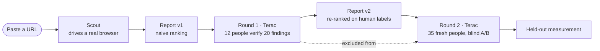

# Overwatch

[](https://github.com/quachphu/Overwatch/actions/workflows/ci.yml)
[](https://www.python.org/downloads/)
[](LICENSE)
[](https://github.com/astral-sh/ruff)

**An agent-run QA company.** Paste a URL. A crew of autonomous agents scans the app, then hires
real people through the [Terac](https://terac.com) API to verify which findings are real and
which matter. Those human labels recalibrate the report — and a second, fresh panel that never
saw round one decides whether it actually got better.

The claim isn't "AI finds bugs." It's: **we measured whether paying humans improved the report,
and here is the number, with its confidence interval.**

Built for the Zero-Human Company Hackathon (Terac, Aug 2026).

---

## How it works



Round 2's panel is prevented from overlapping round 1's by a Terac filter — `launch_round2`
refuses to launch without it. Without that, "fresh panel" would be a false claim.

## Quickstart

```bash
python -m venv .venv && source .venv/bin/activate
pip install -r requirements.txt
playwright install chromium
cp .env.example .env        # fill in API keys
make dev                    # http://localhost:8000
```

```bash
make frontend    # build the React landing page (optional — falls back to Jinja)
make agents      # launch the 5 Band agents
make gate        # lint + tests + unmarked-stub check, before any milestone
```

Every external integration has a standalone probe that makes one real call and prints the raw
response — `make probe SVC=terac`, `SVC=band`, `SVC=replay`. See `RESEARCH.md` for what each one
actually returned.

## What gets measured

`app/metrics.py` is the core deliverable, governed by three rules:

- **Report `n`.** A rate with no denominator isn't a result.
- **Never claim a win the confidence interval doesn't support** — preference gets a Wilson 95%
  interval; a 70/30 split at n=35 counts, 55/45 doesn't.
- **Never score a ranking on the labels used to build it.** Report v2 is fitted to round-1
  labels, so scoring it on those same labels measures the fit, not the improvement — on pure
  coin-flip labels it "improves" by 50 points in 400/400 trials. Every figure is therefore
  reported **held-out**: labels split by finding, v2 rebuilt on one half, both versions scored on
  the other. That's the number the dashboard leads with; the in-sample figure is kept as a
  labeled diagnostic only.

Full derivation and the noise-vs-signal simulation: `RESEARCH.md` §12.5.

## Layout

```
app/
  main.py       FastAPI: ingress, webhooks, task pages, report, dashboard
  pipeline.py   orchestration — every step idempotent, safe to retry
  triage.py     v1 ranking, rater assignment, recalibration to v2
  metrics.py    held-out + in-sample precision, Wilson interval
  security.py   SSRF guard, HMAC webhook verification
  agents/       5 Band agents (Scout, Triage, Recruiter, Bursar, Critic)
  clients/      terac.py, superserve.py — hand-rolled, docs-verified
  sources/      playwright_source.py, replay.py, seed.py
front-end/      React landing page
scripts/        probe_*.py — one real call each, no mocks
tests/          pytest, no network
docs/           spec, agent prompts, decisions, runbook
```

## Docs

- `docs/SPECS.md` — full technical spec
- `docs/AGENTS.md` — the five agent prompts, verbatim
- `docs/DECISIONS.md` — architectural decisions and why
- `docs/RUNBOOK.md` — demo script
- `RESEARCH.md` — verified API surface, bugs found, open unknowns
- `CLAUDE.md` — working agreement and anti-hallucination protocol

## Honesty

Anything inferred rather than verified is marked `# UNKNOWN:` at the point it's used, so it's a
one-line edit to correct. `make fakes` greps for unmarked stubs and must print clean before any
milestone counts as done. If the improvement metric doesn't improve, the real number gets
reported — a truthful negative beats a fabricated lift that doesn't survive Q&A.

## License

MIT — see [LICENSE](LICENSE).
