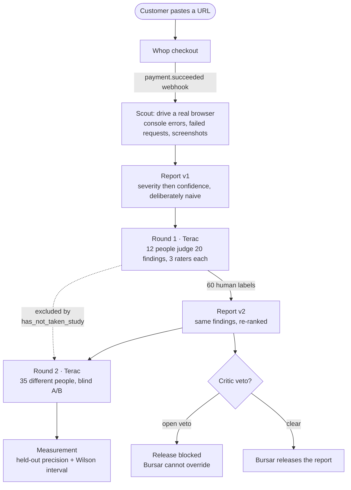

# Overwatch

[](https://github.com/quachphu/Overwatch/actions/workflows/ci.yml)
[](https://www.python.org/downloads/)
[](LICENSE)
[](https://github.com/astral-sh/ruff)

An agent-run QA company. Paste a URL and pay; a crew of autonomous agents scans the app for
bugs, then **hires real people through the Terac API** to judge which findings are real and
which matter. Those human labels recalibrate our triage into a second, better-ranked report —
and a fresh panel of people who never saw the first round decides whether it actually got
better.

The claim is not "AI finds bugs". It is **"we measured whether paying humans made the output
better, and here is the number with its confidence interval."**

Built for the Zero-Human Company Hackathon (Terac, Aug 2026).

---

## How it fits together



The dotted edge is the one that makes the result mean anything: round 2's panel is prevented
from containing round 1's participants by a Terac filter, and `pipeline.launch_round2` refuses
to launch without it.

---

## Run it

```bash
python -m venv .venv && source .venv/bin/activate
pip install -r requirements.txt
playwright install chromium          # the default bug source drives a real browser
cp .env.example .env                 # fill in keys
make dev                             # http://localhost:8000
```

The landing page is a React build. Without it, `/` falls back to a Jinja page using the same
design tokens, so a skipped build degrades the design rather than breaking the site:

```bash
make frontend
```

The five Band agents each need their own registration at `app.band.ai/agents`:

```bash
cp agent_config.yaml.example agent_config.yaml   # gitignored; keys are shown once
make probe SVC=band                              # pre-flight, connects nothing
make agents                                      # 5 processes, one per agent
```

## Verify it without spending money

```bash
make gate        # fakes + lint + test — the one command to run before any milestone
```

or individually:

```bash
make test        # 231 tests, no network
make lint        # ruff
make fakes       # must print "clean" — greps for unmarked stubs
make e2e         # /hooks/whop against a real server; starts and stops its own
make ci          # everything CI runs, locally
```

`make e2e` is the one that catches wiring bugs unit tests cannot see: whether the route reads
Whop's real header names, whether a forged payment can start a paid scan, and whether two
deliveries for one payment start two scans. It found the last of those (`RESEARCH.md` §12.1).

Then rehearse the entire experiment against simulated raters:

```bash
BUG_SOURCE=seed DATABASE_URL=sqlite:///./rehearsal.db \
  python -m uvicorn app.main:app --port 8013 &
make rehearse
```

That runs a scan, serves 12 task pages, submits 60 judgments, recalibrates, and prints both the
held-out and in-sample precision for each report version. **It produces no result** — the
judgments are scripted. What it proves is that the pipeline is wired end to end, which is worth
knowing before twelve people are paid. See `RESEARCH.md` §11.8.

On the current seed fixture the honest held-out figure is a **tie**: the simulated raters confirm
90% of findings, so there is almost nothing for a recalibration to fix. That is a property of the
fixture, not evidence about the product, and it is recorded rather than tuned away.

## Verify the external APIs

Every integration has a probe that makes one real call and prints the raw response. Read the
shape, *then* trust the client:

```bash
make probe SVC=terac
make probe SVC=whop
make probe SVC=band
make probe SVC=replay                                        # auth + list, spends nothing
make probe SVC=replay ARGS="--create https://your.example"    # really starts a project
```

The Replay probe is split in two because creating a project spends credits. The default run only
authenticates; `--create` starts a real exploration and then diffs a real bug object against the
field names `app/sources/replay.py` reads, because **Replay's spec documents no response schema
for any endpoint** — those names are inferred from its webhook payload docs (`RESEARCH.md` §12.3).

---

## How the experiment works

| Stage | What happens | Who does it |
|---|---|---|
| Scan | Drive a browser through the app; capture console errors, failed requests, screenshots | Scout |
| Report v1 | Rank findings by severity then confidence. Deliberately naive — it has to be beatable | Triage Officer |
| Round 1 | Hire 12 people to judge 20 findings, 3 raters each = 60 judgments | Recruiter → Terac |
| Report v2 | Re-rank the **same** findings on the human labels. Nothing is added or removed | Triage Officer |
| Round 2 | Hire 35 **different** people to pick which report is more useful, blind | Recruiter → Terac |
| Release | Gated on a Critic veto that Bursar cannot override | Critic, Bursar |

Round 2's freshness is enforced by Terac's `has_not_taken_study` filter excluding round 1's
opportunity, not by trust. `pipeline.launch_round2` refuses to launch without it, because
without it "a fresh panel" is a false claim and the whole result is contaminated.

## What we measure

`app/metrics.py` is the submission. Three rules govern it:

- **Report `n`.** A rate without a denominator is not a result.
- **Never claim a win the interval does not support.** Preference is reported with a Wilson
  95% interval, and the dashboard consults `preference_is_significant` — which is true only
  when the interval excludes 50%. A 70/30 split at n=35 is real; 55/45 is not.
- **Never score a ranking on the labels that built it.**

That third rule is the one worth explaining, because getting it wrong is silent.

Report v2 is *fitted* to the round-1 labels — it promotes what humans confirmed and demotes what
they rejected. Scoring it against those same labels measures our own fitting procedure, not the
ranking. It is not a subtle effect: feed the pipeline **pure coin-flip labels carrying zero
information** and in-sample `precision@10` still climbs 0.50 → 1.00 in **400 of 400** simulated
trials. A metric that reports a 50-point win on noise cannot evidence a win on signal.

So every precision figure is computed twice:

| | how | status |
|---|---|---|
| **held out** | labels split by finding; v2 rebuilt from one half, both rankings scored on the other | the number we report |
| in sample | fitted and scored on all labels | diagnostic only, shown with the caveat attached |

After the fix, on simulated labels:

| labels contain | in-sample delta | **held-out delta** |
|---|---|---|
| noise | +0.425 (400/400 "wins") | **+0.003** (43 win / 38 lose) |
| signal | +0.396 (400/400 "wins") | **+0.139** (214 win / 8 lose) |

Flat and symmetric on noise, positive on signal — a metric that *can* fail. Both numbers appear
on the dashboard, because a judge who asks "what if you score v2 on its own labels?" should find
that number already on the page rather than discover it was quietly dropped.

Round 2's fresh-panel preference remains the primary result; it is independent by construction.
Full reasoning and the simulation in `RESEARCH.md` §12.5, pinned by
`tests/test_metrics.py::TestHoldoutIsNotCircular`.

Unlabeled findings never count against a ranking. Round 1 buys labels for 20 of N findings, and
scoring the rest as misses would measure our sampling budget rather than the ranking.

## Layout

```
app/
  main.py          FastAPI: ingress, webhooks, task pages, report, dashboard
  pipeline.py      orchestration; every step idempotent so retries are safe
  triage.py        v1 ranking, rater assignment, recalibration to v2
  metrics.py       held-out + in-sample precision, average precision, Wilson interval
  security.py      SSRF guard (resolved-IP based), HMAC webhook verification
  config.py        every env var, read once
  models.py        SQLAlchemy tables + Pydantic models for external payloads
  agents/          5 Band agents; prompts.py is verbatim from docs/AGENTS.md
  clients/         terac.py whop.py superserve.py
  sources/         playwright_source.py replay.py seed.py + evidence store
  templates/       task pages, report, dashboard, landing fallback
  static/          overwatch.css — design tokens shared with the React build
front-end/         React landing hero, built to front-end/design_prompt.md
workflows/         Render Workflows durable orchestration
scripts/           probe_*.py — one real call each; rehearse_experiment.py
tests/             231 tests, no network
docs/              specification, agent prompts, decisions, runbook
.github/workflows/ CI: lint, tests on 3.11 + 3.13, e2e, stub check, frontend build
```

## Development

```bash
make install     # venv + dependencies + ruff
make help        # every target, explained
make fmt         # ruff format
```

Tooling is configured in one place, `pyproject.toml`: dependencies, ruff (lint + format) and
pytest. `requirements.txt` stays the installer of record for deploys — see `docs/DECISIONS.md`.

CI runs lint, the test suite on Python 3.11 and 3.13, the live-server webhook end-to-end test,
the unmarked-stub check, and the landing-page build.

## Documents

Start with `docs/README.md`, which is an index. In short:

- `CLAUDE.md` — working agreement and the anti-hallucination protocol
- `docs/SPECS.md` — full technical specification
- `docs/AGENTS.md` — the five agent prompts, verbatim; `app/agents/prompts.py` transcribes them
- `docs/DECISIONS.md` — architectural decisions and their reasons
- `docs/RUNBOOK.md` — the demo script and what to do when a step fails
- `RESEARCH.md` — verified API surface, contradictions found in our own docs, open unknowns,
  §11 the corrections that surfaced by building it, and §12 the second review pass
- `CONTRIBUTING.md` — how to work in this repo

## Honesty

`RESEARCH.md` §9 lists what is still unverified. Anything inferred rather than read is marked
`# UNKNOWN:` at the top of the file that depends on it, so it is one edit to correct. `make
fakes` greps for unmarked stubs and must print `clean` before any milestone counts as done.

If the improvement metric does not improve, the real number gets reported. A truthful negative
result is worth more than a fabricated lift, and fabricated numbers do not survive Q&A.
